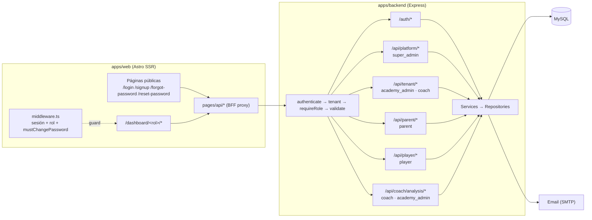
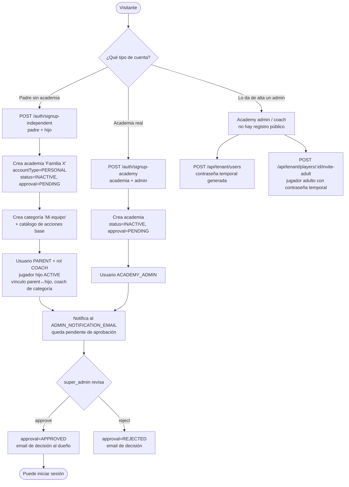
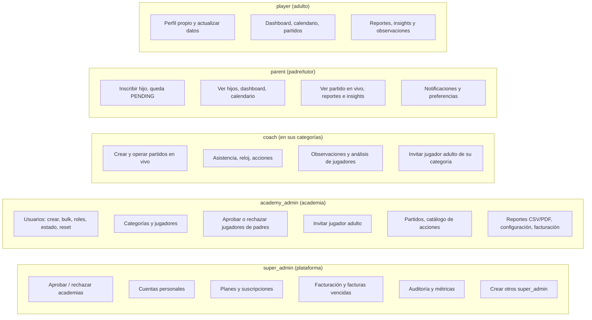
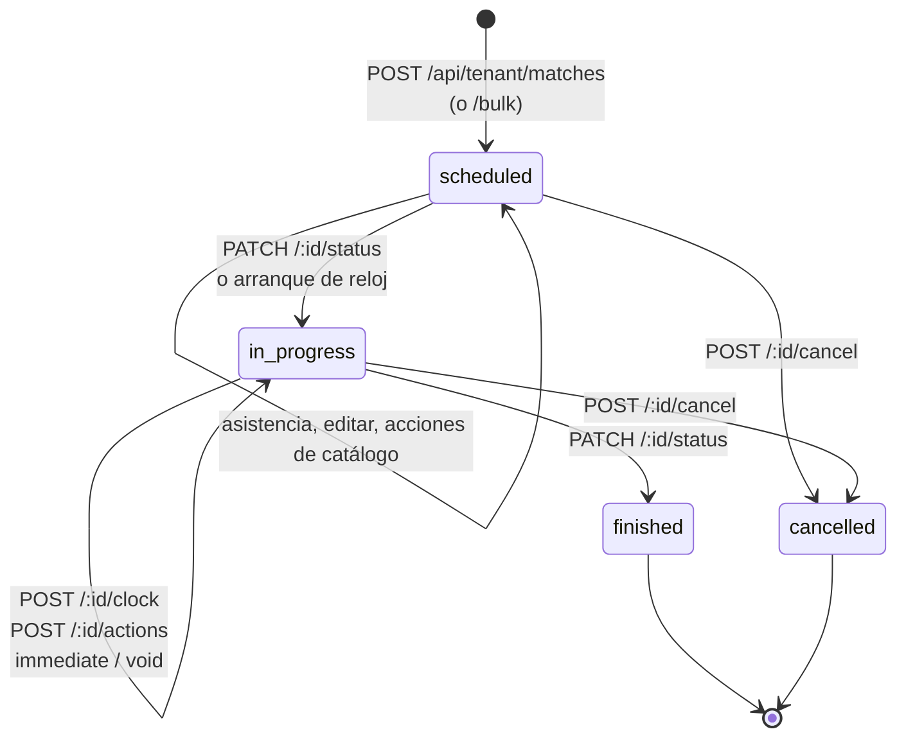
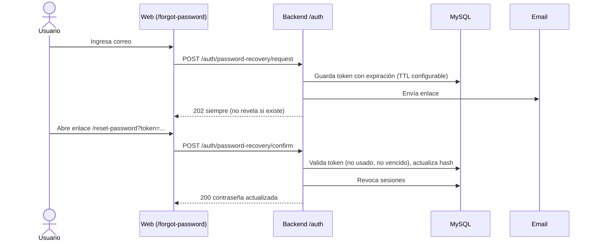

# Flujos de usuario en VeloceSports

Documento de referencia sobre cómo cada rol usa el sistema, desde el registro hasta la operación diaria. Se basa en el código de `apps/backend` (rutas, servicios, middlewares) y `apps/web` (`middleware.ts`, páginas).

Roles de login: `super_admin`, `academy_admin`, `coach`, `parent`, `player` (definidos en `packages/shared/src/roles.ts`).

## 1. Arquitectura general



## 2. Registro: tres caminos



> **Nota:** el login bloquea cualquier academia con `approval_status = PENDING` (`auth.service.ts`). Las cuentas personales también quedan en `PENDING`, y no hay auto-aprobación para ellas. Un padre que se registra no puede entrar hasta que un super_admin lo apruebe.

## 3. Login y puerta de acceso

```mermaid
flowchart TD
    L([POST /auth/login<br/>rate limit]) --> V{Credenciales válidas?}
    V -->|No| E401[401 Credenciales inválidas]
    V -->|Sí| ST{user.status = active?}
    ST -->|No| E403A[403 Usuario inactivo]
    ST -->|Sí| RS{Combinación de roles válida?<br/>super_admin no mezcla roles}
    RS -->|No| E403B[403 Rol sin acceso]
    RS -->|Sí| SA{¿Es super_admin?}
    SA -->|Sí| TOK
    SA -->|No| AP{approval_status}
    AP -->|PENDING| E403C[403 Pendiente de aprobación]
    AP -->|REJECTED| E403D[403 Solicitud no aprobada]
    AP -->|APPROVED| AC{academy.status}
    AC -->|SUSPENDED| E403E[403 Academia suspendida]
    AC -->|no ACTIVE| E403F[403 Academia no activa]
    AC -->|ACTIVE| TOK[Access token + refresh token]
    TOK --> MCP{must_change_password?}
    MCP -->|Sí| CPR[/dashboard/change-password-required]
    MCP -->|No| RED{Redirige por rol}
    RED --> D1[/dashboard/super-admin]
    RED --> D2[/dashboard/academy-admin]
    RED --> D3[/dashboard/coach]
    RED --> D4[/dashboard/parent]
    RED --> D5[/dashboard/player]
```

`middleware.ts` vuelve a validar cada ruta `/dashboard/*`: sin sesión redirige a `/login?redirect=...`; con un rol que no corresponde, lo devuelve a su dashboard.

## 4. Qué hace cada usuario



## 5. Ciclo de un partido



## 6. Recuperación de contraseña



## Pendientes conocidos

1. **Acceso de cuentas personales:** requieren aprobación manual de super_admin. Confirmar si es el comportamiento deseado o si la UI de registro debe indicarlo.
2. **Contraseña temporal en la respuesta de la API:** `POST /api/tenant/users` y `POST /api/tenant/players/:id/invite-adult` devuelven la contraseña temporal en claro. Revisar cómo se entrega al usuario.
